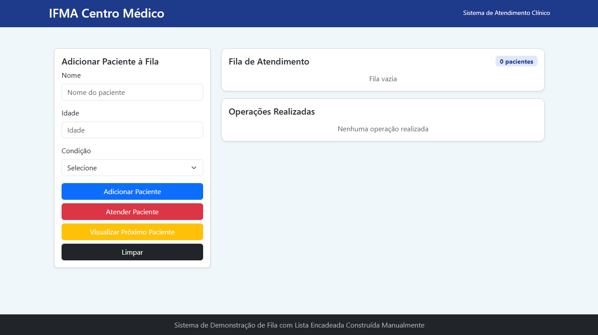

# 🚑 Clínica IFMA Centro Médico – Gerenciador de Fila

Um sistema web simples para gerenciamento de fila de atendimento em clínica médica.  
Este projeto demonstra, na prática, o uso de uma **fila encadeada em JavaScript** para controlar a ordem de chegada dos pacientes.

## 🌐 Tela Inicial do Projeto

Abaixo, uma visão geral da página principal ao abrir a aplicação:




## 📝 Descrição do Projeto

Esta aplicação foi criada como parte do Trabalho da disciplica de Estrutura de Dados para o curso de Análise e Desenvolvimento de Sistemas no IFMA campus Coelho Neto.  
O objetivo é manter a ordem de chegada dos pacientes em uma clínica, garantindo que quem chegar primeiro seja atendido primeiro (FIFO). Usamos uma **fila encadeada** para representar cada paciente como um nó, permitindo:

- Adicionar (enfileirar) pacientes ao final.  
- Remover (desenfileirar) pacientes do início.  
- Consultar quem é o próximo a ser atendido (espiar).  
- Limpar toda a fila de uma só vez.  

O site é construído em HTML, CSS , Bootstrap e JavaScript. A interface é minimalista e intuitiva, focada em demonstrar o funcionamento da fila encadeada no front-end.

---

## 🚀 Funcionalidades

- **Enfileirar Paciente**  
  - Insere um novo paciente ao final da fila.  
  - Requer apenas o nome do paciente (campo de texto).  

- **Desenfileirar Paciente**  
  - Remove o paciente que está no início da fila e exibe quem está sendo atendido.  
  - Atualiza automaticamente a lista de espera.  

- **Espiar Próximo Paciente**  
  - Exibe, sem remover, o nome do paciente que será atendido em seguida.  

- **Limpar Fila**  
  - Reseta toda a estrutura de dados, esvaziando instantaneamente a fila.  

- **Validações Simples**  
  - Não permite enfileirar com campo vazio.  
  - Exibe mensagem “Fila vazia” se não houver pacientes ao desenfileirar ou espiar.  

---

## 🛠 Tecnologias Utilizadas

- **HTML5** – Estruturação da página web.  
- **CSS3** – Estilização e layout responsivo.  
- **Bootstrap 4/5** – Biblioteca de componentes para responsividade.
- **JavaScript (ES6+)** – Lógica da fila encadeada, manipulação do DOM.  

---

## 💻 Como Rodar Localmente

1. **Clone o repositório**  
   ```bash
   git clone https://github.com/Felype-cybher/ProjetoEstruturaDeDados.git
